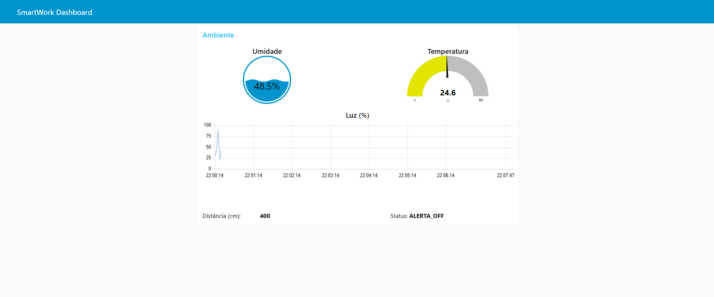
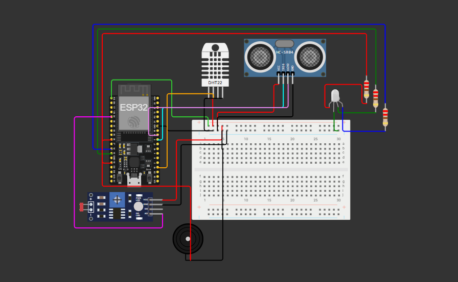

# 🧘‍♂️ SmartWork Balance: Solução IoT para Bem-Estar Corporativo

 

## 👥 Integrantes do Grupo

- **[Áurea Sardinha Carminato]** - RM: [563837]
- **[Henrique Castro de Matos]** - RM: [564560]
- **[Laura Tigre Amaral]** - RM: [565281]

---

## 🧐 Contexto e Problema

O modelo de trabalho híbrido e remoto trouxe flexibilidade, mas também **desafios silenciosos** para a saúde ocupacional:

- **Ambiente Invisível:** Trabalhadores operam em locais com iluminação inadequada e desconforto térmico, gerando fadiga visual e queda de produtividade.
- **Sedentarismo Crítico:** A falta de movimentação e pausas regulares aumenta o risco de doenças crônicas e LER/DORT.
- **Gestão Cega:** Gestores e RHs não possuem dados reais sobre as condições de trabalho das equipes remotas.

## 💡 A Solução: SmartWork Balance

O **SmartWork Balance** não é apenas um dispositivo de monitoramento; é uma **Plataforma de Gestão de Bem-Estar**.

Utilizando IoT (Internet das Coisas), o sistema coleta dados ambientais em tempo real e os transforma em **insights acionáveis**, atuando de forma preventiva através de feedbacks físicos (luz e som) e digitais (dashboards).

---

## 🎯 Cenários de Aplicação (Por que isso é útil?)

### 1. Para o Profissional (Autogestão)

- **O Problema:** "Estou com dor de cabeça e não sei o motivo."
- **A Solução:** O dashboard alerta que a luminosidade caiu abaixo de 30%, forçando a visão. O sistema sugere acender uma luz auxiliar.
- **O Problema:** "Perdi a noção do tempo sentado."
- **A Solução:** O sensor de presença detecta 50 min de inatividade. O Buzzer toca um som suave e o LED fica vermelho, indicando a hora da pausa (Técnica Pomodoro automatizada).

### 2. Para Gestores de Facilidades e RH (Visão Macro)

- **Aplicação:** Monitoramento centralizado de escritórios ou hubs de coworking.
- **Valor:** Identificar zonas de calor excessivo ou má iluminação para realizar reformas estruturais baseadas em dados reais, não em "achismo".

---

## 🛠️ Arquitetura Técnica

### Hardware (Simulado no Wokwi)

- **Microcontrolador:** ESP32 (Wi-Fi Integrado).
- **Monitoramento Ambiental:**
  - Sensor **DHT22** (Temperatura e Umidade).
  - Sensor **LDR** (Nível de Luminosidade).
- **Monitoramento Comportamental:**
  - Sensor **Ultrassônico HC-SR04** (Detecção de Presença/Sedentarismo).
- **Interface de Feedback:**
  - **LED RGB:** Feedback visual de status (Verde=OK, Vermelho=Alerta).
  - **Buzzer:** Alerta sonoro para pausas urgentes.

### Fluxo de Dados (MQTT)

A comunicação é totalmente bidirecional via protocolo MQTT:

1.  **ESP32 (Publisher):** Lê sensores e envia JSON para o Broker.
2.  **Node-RED (Subscriber/Logic):** Recebe dados, processa regras de negócio e exibe no Dashboard.
3.  **Node-RED (Publisher):** Se uma regra crítica for quebrada (ex: Temp > 30°C), envia comando de volta.
4.  **ESP32 (Subscriber):** Recebe comando e aciona Buzzer/LED.

---

## 📡 Configuração e Tópicos MQTT

Para replicar este projeto, utilize as seguintes configurações:

- **Broker MQTT:** `test.mosquitto.org` (Público)
- **Porta:** `1883`

| Função               | Tópico                  | Payload Exemplo                                             |
| :------------------- | :---------------------- | :---------------------------------------------------------- |
| **Enviar Dados**     | `fiap/smartwork/dados`  | `{"temp": 24.5, "umidade": 60, "luz": 80, "distancia": 45}` |
| **Receber Comandos** | `fiap/smartwork/alerta` | `"ALERTA_ON"` ou `"ALERTA_OFF"`                             |

---

## 🚀 Instruções de Uso e Replicação

### Passo 1: Hardware (Simulação)

Acesse o projeto completo e funcional no simulador Wokwi através do link abaixo:
👉 **[[PROJETO WOKWI](https://wokwi.com/projects/445703969951627265)]**

### Passo 2: Software (Dashboard)

O "cérebro" da aplicação roda no Node-RED.

1.  Instale o [Node-RED](https://nodered.org/).
2.  Instale o pacote de dashboard: `npm install node-red-dashboard`.
3.  Importe o arquivo `flow.json` disponível na pasta `/nodered` deste repositório.
4.  Acesse o painel em: `http://localhost:1880/ui`.

---

## 📺 Vídeo Demonstrativo

Confira a explicação do problema, a arquitetura técnica e a demonstração prática do sistema reagindo aos sensores:

👉 **[[CLIQUE AQUI](https://youtu.be/WrQBLdxNZqw)]**

---

## 📸 Galeria do Projeto

### Dashboard de Gestão (Node-RED)

_Visualização em tempo real das métricas de saúde e ambiente._

### Circuito Eletrônico

_Esquema de montagem utilizando ESP32 e sensores._

---
